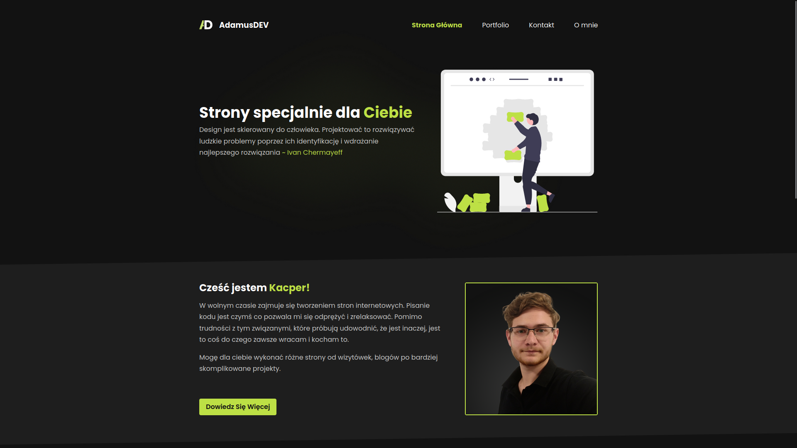

# Bielsania


Portfolio AdamusDEV

## Włączenie servera z projektem

```bash
#Pobranie bibliotek
npm run i

#Odpalenie servera developerskiego
npm run dev
```

Następnie należy wejść pod link [http://localhost:5173](http://localhost:5173)

## Budowa projektu

```bash
#Zbudowanie projektu
npm run build
```
